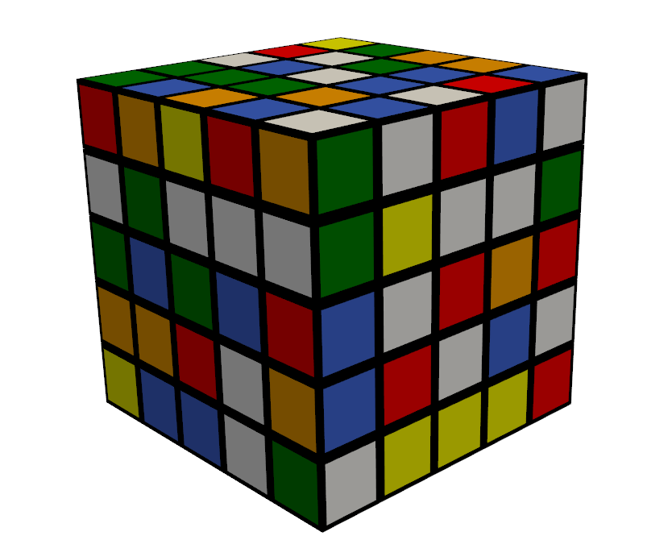
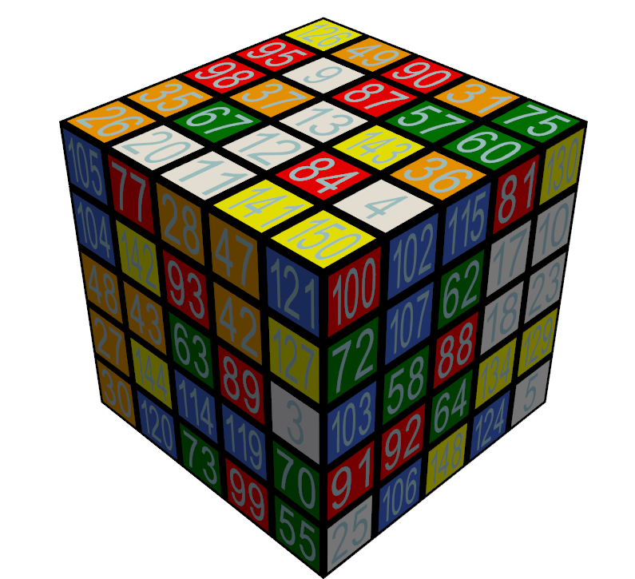

# Description

[](https://pepy.tech/project/super-rubik-cube)
[](https://pepy.tech/project/super-rubik-cube)

Library for Rubik's Cube manipulation. Creator and customizer for cubes of any size, and solver for 2x2 and 3x3 cubes (Herbert Kociemba's algorithms)

# Installation

```
pip install super-rubik-cube
```

# Usage
## Creating instance of cube
You can create Rubik's cube, Pocket cube and NxN cube, where N means positive number.
```
import supercube

rubiks_cube = supercube.RubiksCube() # creates 3X3 cube
pocket_cube = supercube.PocketCube() # creates 2x2 cube
n_cube = supercube.NCube(7) # creates NxN cube (in this case N is 7)

rubiks_cube.show()
rubiks_cube.show(colors=True)

pocket_cube.show()
pocket_cube.show(colors=True)

n_cube.show()
n_cube.show(colors=True)
```
Output:
```
             +------------+
             |  1   2   3 |
             |  4   5   6 |
             |  7   8   9 |
+------------+------------+------------+------------+
| 10  11  12 | 19  20  21 | 28  29  30 | 37  38  39 | 
| 13  14  15 | 22  23  24 | 31  32  33 | 40  41  42 | 
| 16  17  18 | 25  26  27 | 34  35  36 | 43  44  45 | 
+------------+------------+------------+------------+
             | 46  47  48 |
             | 49  50  51 |
             | 52  53  54 |
             +------------+
⬛⬛⬛ 🟪🟪🟪
⬛⬛⬛ 🟪🟪🟪
⬛⬛⬛ 🟪🟪🟪

🟧🟧🟧 🟩🟩🟩 🟥🟥🟥 🟦🟦🟦 
🟧🟧🟧 🟩🟩🟩 🟥🟥🟥 🟦🟦🟦 
🟧🟧🟧 🟩🟩🟩 🟥🟥🟥 🟦🟦🟦 

⬛⬛⬛ 🟨🟨🟨
⬛⬛⬛ 🟨🟨🟨
⬛⬛⬛ 🟨🟨🟨


         +--------+
         |  1   2 |
         |  3   4 |
+--------+--------+--------+--------+
|  5   6 |  9  10 | 13  14 | 17  18 | 
|  7   8 | 11  12 | 15  16 | 19  20 | 
+--------+--------+--------+--------+
         | 21  22 |
         | 23  24 |
         +--------+
⬛⬛ 🟪🟪
⬛⬛ 🟪🟪

🟧🟧 🟩🟩 🟥🟥 🟦🟦 
🟧🟧 🟩🟩 🟥🟥 🟦🟦 

⬛⬛ 🟨🟨
⬛⬛ 🟨🟨


                                    +-----------------------------------+
                                    |   1    2    3    4    5    6    7 |
                                    |   8    9   10   11   12   13   14 |
                                    |  15   16   17   18   19   20   21 |
                                    |  22   23   24   25   26   27   28 |
                                    |  29   30   31   32   33   34   35 |
                                    |  36   37   38   39   40   41   42 |
                                    |  43   44   45   46   47   48   49 |
+-----------------------------------+-----------------------------------+-----------------------------------+-----------------------------------+
|  50   51   52   53   54   55   56 |  99  100  101  102  103  104  105 | 148  149  150  151  152  153  154 | 197  198  199  200  201  202  203 | 
|  57   58   59   60   61   62   63 | 106  107  108  109  110  111  112 | 155  156  157  158  159  160  161 | 204  205  206  207  208  209  210 | 
|  64   65   66   67   68   69   70 | 113  114  115  116  117  118  119 | 162  163  164  165  166  167  168 | 211  212  213  214  215  216  217 | 
|  71   72   73   74   75   76   77 | 120  121  122  123  124  125  126 | 169  170  171  172  173  174  175 | 218  219  220  221  222  223  224 | 
|  78   79   80   81   82   83   84 | 127  128  129  130  131  132  133 | 176  177  178  179  180  181  182 | 225  226  227  228  229  230  231 | 
|  85   86   87   88   89   90   91 | 134  135  136  137  138  139  140 | 183  184  185  186  187  188  189 | 232  233  234  235  236  237  238 | 
|  92   93   94   95   96   97   98 | 141  142  143  144  145  146  147 | 190  191  192  193  194  195  196 | 239  240  241  242  243  244  245 | 
+-----------------------------------+-----------------------------------+-----------------------------------+-----------------------------------+
                                    | 246  247  248  249  250  251  252 |
                                    | 253  254  255  256  257  258  259 |
                                    | 260  261  262  263  264  265  266 |
                                    | 267  268  269  270  271  272  273 |
                                    | 274  275  276  277  278  279  280 |
                                    | 281  282  283  284  285  286  287 |
                                    | 288  289  290  291  292  293  294 |
                                    +-----------------------------------+
⬛⬛⬛⬛⬛⬛⬛ 🟪🟪🟪🟪🟪🟪🟪
⬛⬛⬛⬛⬛⬛⬛ 🟪🟪🟪🟪🟪🟪🟪
⬛⬛⬛⬛⬛⬛⬛ 🟪🟪🟪🟪🟪🟪🟪
⬛⬛⬛⬛⬛⬛⬛ 🟪🟪🟪🟪🟪🟪🟪
⬛⬛⬛⬛⬛⬛⬛ 🟪🟪🟪🟪🟪🟪🟪
⬛⬛⬛⬛⬛⬛⬛ 🟪🟪🟪🟪🟪🟪🟪
⬛⬛⬛⬛⬛⬛⬛ 🟪🟪🟪🟪🟪🟪🟪

🟧🟧🟧🟧🟧🟧🟧 🟩🟩🟩🟩🟩🟩🟩 🟥🟥🟥🟥🟥🟥🟥 🟦🟦🟦🟦🟦🟦🟦 
🟧🟧🟧🟧🟧🟧🟧 🟩🟩🟩🟩🟩🟩🟩 🟥🟥🟥🟥🟥🟥🟥 🟦🟦🟦🟦🟦🟦🟦 
🟧🟧🟧🟧🟧🟧🟧 🟩🟩🟩🟩🟩🟩🟩 🟥🟥🟥🟥🟥🟥🟥 🟦🟦🟦🟦🟦🟦🟦 
🟧🟧🟧🟧🟧🟧🟧 🟩🟩🟩🟩🟩🟩🟩 🟥🟥🟥🟥🟥🟥🟥 🟦🟦🟦🟦🟦🟦🟦 
🟧🟧🟧🟧🟧🟧🟧 🟩🟩🟩🟩🟩🟩🟩 🟥🟥🟥🟥🟥🟥🟥 🟦🟦🟦🟦🟦🟦🟦 
🟧🟧🟧🟧🟧🟧🟧 🟩🟩🟩🟩🟩🟩🟩 🟥🟥🟥🟥🟥🟥🟥 🟦🟦🟦🟦🟦🟦🟦 
🟧🟧🟧🟧🟧🟧🟧 🟩🟩🟩🟩🟩🟩🟩 🟥🟥🟥🟥🟥🟥🟥 🟦🟦🟦🟦🟦🟦🟦 

⬛⬛⬛⬛⬛⬛⬛ 🟨🟨🟨🟨🟨🟨🟨
⬛⬛⬛⬛⬛⬛⬛ 🟨🟨🟨🟨🟨🟨🟨
⬛⬛⬛⬛⬛⬛⬛ 🟨🟨🟨🟨🟨🟨🟨
⬛⬛⬛⬛⬛⬛⬛ 🟨🟨🟨🟨🟨🟨🟨
⬛⬛⬛⬛⬛⬛⬛ 🟨🟨🟨🟨🟨🟨🟨
⬛⬛⬛⬛⬛⬛⬛ 🟨🟨🟨🟨🟨🟨🟨
⬛⬛⬛⬛⬛⬛⬛ 🟨🟨🟨🟨🟨🟨🟨
```
You can also define your own state (number of elements of specific colors is not limited). When you define your own 
state, numeric values are being reset to default positions.
```
pocket_cube.define_state("RRRRRRRRRRRRRRRRRRRRRRRR")
pocket_cube.show()
pocket_cube.show(colors=True)
```
Output:
```
         +--------+
         |  1   2 |
         |  3   4 |
+--------+--------+--------+--------+
|  5   6 |  9  10 | 13  14 | 17  18 | 
|  7   8 | 11  12 | 15  16 | 19  20 | 
+--------+--------+--------+--------+
         | 21  22 |
         | 23  24 |
         +--------+
⬛⬛ 🟥🟥
⬛⬛ 🟥🟥

🟥🟥 🟥🟥 🟥🟥 🟥🟥 
🟥🟥 🟥🟥 🟥🟥 🟥🟥 

⬛⬛ 🟥🟥
⬛⬛ 🟥🟥
```
You can get your current state using method `get_state`, the return will be 3d array.
```
print(rubiks_cube.get_state())
```
Output:
```
[[[1, 2, 3], [4, 5, 6], [7, 8, 9]], [[10, 11, 12], [13, 14, 15], [16, 17, 18]], [[19, 20, 21], [22, 23, 24], [25, 26, 27]], [[28, 29, 30], [31, 32, 33], [34, 35, 36]], [[37, 38, 39], [40, 41, 42], [43, 44, 45]], [[46, 47, 48], [49, 50, 51], [52, 53, 54]]]
```
You can also get color of element by using function `get_color_by_element(element: int)`
## Moves
### Basic moves
You can move cube using method `move`
```
rubiks_cube.move("L B' F2 U R2 F L2 U B2 R2 F D L' D L' D2 R' U' B2 F' L R'")
rubiks_cube.show()
```
Output:
```
             +------------+
             | 30   4  36 |
             | 31   5  38 |
             | 27  49  10 |
+------------+------------+------------+------------+
|  3  24  48 | 34  17   1 | 39   2  54 | 43  11  37 | 
| 26  14  40 | 33  23  53 | 44  32  51 | 35  41  47 | 
| 46  22  52 | 45  42   7 | 19   8   9 | 28   6  25 | 
+------------+------------+------------+------------+
             | 16  13  12 |
             | 15  50  20 |
             | 18  29  21 |
             +------------+

```
### Advanced moves
Advanced moves are also supported. For each basic move there are:

* wide moves (e.g. Fw, 4Fw', 5Fw2) - for wide move default value is 2 (when there is no number before move)
* specific layer moves (e.g 3U, 5D')

```
n_cube.move("3Bw 3R2 D' 3Bw 2Rw' 3Fw R2 3Rw' 2B' 3R 2Fw2 3U2 L' 2Dw B")
n_cube.show()

```
Output:
```
                                    +-----------------------------------+
                                    |  43   36  176  267  260  191  190 |
                                    | 140  160  167  174  283  188  195 |
                                    |  54  279  278  277  276   40  101 |
                                    | 126   23   24   25  271   72  102 |
                                    |  52   89   82   75   68   16  231 |
                                    |  51  107   65  158  157  156  155 |
                                    |  50  106   64  151  150  149  148 |
+-----------------------------------+-----------------------------------+-----------------------------------+-----------------------------------+
|  99  183   29  169   15    8    1 | 203   63  217   28   35   42   49 | 105  112   78   46   45  287  147 | 252  259   96   95  133   55   56 | 
|  93  184  285  170  110  237  244 | 289   62   30   27   34   41   48 | 104  111   79   39   38  286  146 | 251  258   59  125   61  139  281 | 
| 290  181   31   26   33  118  119 | 162  132  117  124  131  138  145 | 250   12  264   67  180  177   47 | 103  185  215  222  229  236  243 | 
| 291   60   32   74   81   88  144 | 249  223  116  123  130  137  193 | 273  272  171  172  269  284   71 | 224  186  214  221  228  235  242 | 
| 292  187   80  173  166  159  152 |  21  216  115  122  129  136  192 | 266  265  178  179  262  208  143 | 248  255  213  220  227  234  241 | 
| 293   58  257  207  206  205  153 |  14   13   87   11  275  282  142 | 247  209  114  121  128  135   44 | 100   86  212  219  226  233  240 | 
| 288   57  201  200  199  198  294 | 196  189   94  175  168  161  154 |   7  202  113  120  127  134  141 | 246  253  280   22  225   85   92 | 
+-----------------------------------+-----------------------------------+-----------------------------------+-----------------------------------+
                                    | 239  232  274  218  211  204  197 |
                                    |   6  254   20  256  163    9    2 |
                                    |   5  261   19  263  164   69   70 |
                                    |   4  268   18  270  165   76   77 |
                                    |   3   10   17   73   66   83   84 |
                                    | 210   37  230  109  108   90   91 |
                                    | 245  238  182   53  194   97   98 |
                                    +-----------------------------------+
```
## Scrambling
You can scramble cube by using method `scramble(number_of_moves=30)`(default value is 30)
```
print(rubiks_cube.scramble())
rubiks_cube.show()
rubiks_cube.show(colors=True)
```
Output:
```
L R2 D D2 F' F' U2 F2 U' B2 B2 U2 R' R2 L2 U2 B' F F2 B R U2 R F2 R' R' D' U' D' D 
             +------------+
             | 25  47  52 |
             | 44   5  17 |
             | 10  38  19 |
+------------+------------+------------+------------+
| 46  53   1 | 39   2   7 | 12  49  16 | 45  26  18 | 
| 11  14  29 |  6  23  40 | 33  32  51 | 35  41   4 | 
|  3  13  27 | 34  31  21 |  9  15  36 | 43  20  30 | 
+------------+------------+------------+------------+
             | 48  24  28 |
             | 42  50  22 |
             | 37   8  54 |
             +------------+
⬛⬛⬛ 🟩🟨🟨
⬛⬛⬛ 🟦🟪🟧
⬛⬛⬛ 🟧🟦🟩

🟨🟨🟪 🟦🟪🟪 🟧🟨🟧 🟦🟩🟧 
🟧🟧🟥 🟪🟩🟦 🟥🟥🟨 🟥🟦🟪 
🟪🟧🟩 🟥🟥🟩 🟪🟧🟥 🟦🟩🟥 

⬛⬛⬛ 🟨🟩🟥
⬛⬛⬛ 🟦🟨🟩
⬛⬛⬛ 🟦🟪🟨
```
You can also scramble big cubes 
```
print(n_cube.scramble())
n_cube.show()
n_cube.show(colors=True)
```
Output:
```
3D' L' R 3Bw' 3U2 F D 2Lw2 3L 3R2 R' 3Bw2 R' L2 2U' 2Lw2 2F2 R 3Uw2 3U2 3D2 D' D' 2Uw2 3Uw2 2Rw' 2R2 2Uw 3D 2Rw2 
                                    +-----------------------------------+
                                    |  92  259  176  200  260  189  196 |
                                    |  93   37   30   27   34  139  195 |
                                    | 211  181  180  263  264  206  194 |
                                    | 218  272  271   25   32  137  126 |
                                    |   3   40   33   81  117  114  290 |
                                    | 112  111  234  109  118  209  140 |
                                    | 105  240  241  144  266   36  190 |
+-----------------------------------+-----------------------------------+-----------------------------------+-----------------------------------+
| 288  281  168  175  201  155  148 |  49  293  292  249  192   55  147 | 252  183  243  169  280  287  294 | 239  232   96    4  133  191  245 | 
|  57   90   10   88   87  156   63 | 106    9   89  121  132  254  198 |   6  184   20  170  230  188   48 | 104   41  285  284  185  135  210 | 
| 113   16  131   18   17   59  248 | 143  136  166  220  215  187   47 | 103  257   82  116  164  138  145 | 250  212   66  122  213  108   70 | 
| 273  174  173   74  277   11  291 | 242  207   24  123  214   23  120 |  77  186  171  172   73   72   28 | 151  158  165  221  222  235  193 | 
| 199   69   31  124  115  110  182 | 225  226  276  228  129   65   64 | 217  128  227  130  278  279   35 | 150  157  229   75   19  283    5 | 
| 244  205  208  219  167  233  153 |  14   86   38  125  216  286   42 | 149   13   12   76  275   58  142 | 247  107  163  223  236  282  289 | 
| 141   44   45   46   21  134    7 | 197  204  162   22  127    2   99 |  56  253  231  267   52   51   50 | 203  251   94   71   29   85   98 | 
+-----------------------------------+-----------------------------------+-----------------------------------+-----------------------------------+
                                    | 154  161  119   53   84  202   43 |
                                    |  91  160   79   60  261  258   97 |
                                    | 152  159   80   67  262  177   78 |
                                    | 102  256   26  270  179  268   95 |
                                    | 101  255   68  269  178   61   15 |
                                    | 100   62   83   39  265  237    8 |
                                    | 246  238   54  224  274  146    1 |
                                    +-----------------------------------+
⬛⬛⬛⬛⬛⬛⬛ 🟧🟨🟥🟦🟨🟥🟥
⬛⬛⬛⬛⬛⬛⬛ 🟧🟪🟪🟪🟪🟩🟥
⬛⬛⬛⬛⬛⬛⬛ 🟦🟥🟥🟨🟨🟦🟥
⬛⬛⬛⬛⬛⬛⬛ 🟦🟨🟨🟪🟪🟩🟩
⬛⬛⬛⬛⬛⬛⬛ 🟪🟪🟪🟧🟩🟩🟨
⬛⬛⬛⬛⬛⬛⬛ 🟩🟩🟦🟩🟩🟦🟩
⬛⬛⬛⬛⬛⬛⬛ 🟩🟦🟦🟩🟨🟪🟥

🟨🟨🟥🟥🟦🟥🟥 🟪🟨🟨🟨🟥🟧🟩 🟨🟥🟦🟥🟨🟨🟨 🟦🟦🟧🟪🟩🟥🟦 
🟧🟧🟪🟧🟧🟥🟧 🟩🟪🟧🟩🟩🟨🟦 🟪🟥🟪🟥🟦🟥🟪 🟩🟪🟨🟨🟥🟩🟦 
🟩🟪🟩🟪🟪🟧🟨 🟩🟩🟥🟦🟦🟥🟪 🟩🟨🟧🟩🟥🟩🟩 🟨🟦🟧🟩🟦🟩🟧 
🟨🟥🟥🟧🟨🟪🟨 🟦🟦🟪🟩🟦🟪🟩 🟧🟥🟥🟥🟧🟧🟪 🟥🟥🟥🟦🟦🟦🟥 
🟦🟧🟪🟩🟩🟩🟥 🟦🟦🟨🟦🟩🟧🟧 🟦🟩🟦🟩🟨🟨🟪 🟥🟥🟦🟧🟪🟨🟪 
🟦🟦🟦🟦🟥🟦🟥 🟪🟧🟪🟩🟦🟨🟪 🟥🟪🟪🟧🟨🟧🟩 🟨🟩🟥🟦🟦🟨🟨 
🟩🟪🟪🟪🟪🟩🟪 🟦🟦🟥🟪🟩🟪🟩 🟧🟨🟦🟨🟧🟧🟧 🟦🟨🟧🟧🟪🟧🟧 

⬛⬛⬛⬛⬛⬛⬛ 🟥🟥🟩🟧🟧🟦🟪
⬛⬛⬛⬛⬛⬛⬛ 🟧🟥🟧🟧🟨🟨🟧
⬛⬛⬛⬛⬛⬛⬛ 🟥🟥🟧🟧🟨🟥🟧
⬛⬛⬛⬛⬛⬛⬛ 🟩🟨🟪🟨🟥🟨🟧
⬛⬛⬛⬛⬛⬛⬛ 🟩🟨🟧🟨🟥🟧🟪
⬛⬛⬛⬛⬛⬛⬛ 🟩🟧🟧🟪🟨🟦🟪
⬛⬛⬛⬛⬛⬛⬛ 🟨🟦🟧🟦🟨🟩🟪
```

# Solving
Only Rubik's cube and Pocket cube can be solved. Cubes are solved with Herbert Kociemba's algorithm.
```
print(rubiks_cube.scramble())
rubiks_cube.show()

print(rubiks_cube.solve())
rubiks_cube.show()
```
Output:
```
D' L2 U' F' D2 U U' B' D2 R' B F R2 F R' D' B2 R' B2 B2 B' L' U2 U2 U' F' L' L' U2 F' 
             +------------+
             | 30  31  46 |
             | 33   5  53 |
             | 43  26  19 |
+------------+------------+------------+------------+
|  3  40  36 | 54  47   7 | 12  44  25 | 18  24  37 | 
|  8  14  22 | 15  23  49 | 17  32   4 | 11  41  20 | 
|  9  29  34 | 48   2  10 | 39  51  52 | 45  13  21 | 
+------------+------------+------------+------------+
             | 27  38   1 |
             |  6  50  35 |
             | 28  42  16 |
             +------------+
R2 F B2 R2 U R L2 U2 L D2 F' U B2 D' L2 U' D2 B2 U' L2 U
             +------------+
             |  1   2   3 |
             |  4   5   6 |
             |  7   8   9 |
+------------+------------+------------+------------+
| 10  11  12 | 19  20  21 | 28  29  30 | 37  38  39 | 
| 13  14  15 | 22  23  24 | 31  32  33 | 40  41  42 | 
| 16  17  18 | 25  26  27 | 34  35  36 | 43  44  45 | 
+------------+------------+------------+------------+
             | 46  47  48 |
             | 49  50  51 |
             | 52  53  54 |
             +------------+
```
Pocket cube solving procedure is the same.

# 3D Visualization
For 3D visualization you can use method `show_3d()`. Generation of big cubes may take some time due to large amount of 3D elements.
```
cube = supercube.NCube(5)
cube.scramble()
cube.show_3d()
```
Output:



To display cube with numbers on stickers just use argument `numbers` in method `show_3d(numbers=True)`

```
cube = supercube.NCube(5)
cube.scramble()
cube.show_3d(numbers=True)
```
Output:



## Jupyter Notebook

It is also possible to display 3D cube in Jupyter Notebook with `show_3d(notebook=True)`

```
cube = supercube.NCube(5)
cube.scramble()
cube.show_3d(notebook=True)
```
